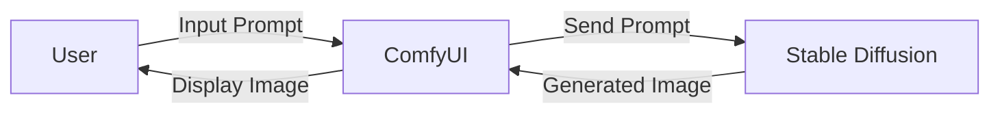

# 🧠 Image Generation using Stable Diffusion & Comfy UI

A project developed under the AICTE Internship on AI: Transformative Learning with TechSaksham, a joint CSR initiative by Microsoft, SAP, and AICTE, implemented by Edunet Foundation.

## 📌 Project Overview

This project leverages the power of Stable Diffusion, a state-of-the-art deep generative model, integrated with Comfy UI, to create a scalable, user-friendly image generation system. The goal is to simplify the image generation process, enabling users—regardless of their technical expertise—to generate high-quality, photorealistic, and creative images from natural language prompts.

## 🎯 Objectives

✅ Design an intuitive interface using Comfy UI for simplified image generation

✅ Empower users to control style, resolution, and quality with customizable parameters

✅ Streamline workflows for efficient real-time image generation

✅ Enable applications across design, education, advertising, gaming, and content creation

## 🛠️ Tech Stack & Requirements

This project utilizes a combination of modern hardware, operating systems, programming languages, and libraries to support AI-powered image generation using Stable Diffusion and Comfy UI.

### 🖥️ Operating System

✅ Windows 10/11

✅ macOS

✅ Linux (Ubuntu or other major distributions)

Note: Cross-platform compatibility ensured.

### ⚙️ Hardware Requirements

🔧 CPU: Multi-core modern processor (Intel i5/i7 or AMD equivalent)

🎮 GPU: NVIDIA GPU (Recommended for faster model inference)

🧠 RAM: Minimum 16 GB (32 GB recommended for optimal performance)

### 🧰 Software Requirements

🐍 Python: Version 3.8 or higher

### 📦 Python Libraries & Frameworks:

  ✅ NumPy – For efficient numerical operations

  ✅ PyTorch – Core framework for deep learning and model training

  ✅ Transformers – To power the Stable Diffusion model

  ✅ Pillow – For advanced image processing

  ✅ Flask – For lightweight backend deployment

  ✅ Requests – For making HTTP API calls

### 🛠️ Additional Tools & Utilities:

  ✅ TQDM – For progress visualization in loops

  ✅ Filelock – To manage file-level concurrency

  ✅ Gradio – For building interactive frontend interfaces

  ✅ Omegaconf – For managing configurations cleanly

 

## 🧠 System Architecture

The architecture of this project is designed to provide a seamless and intuitive pipeline for **text-to-image generation** using **Stable Diffusion** integrated with **ComfyUI**.

### 📊 Architecture Overview



###  🧩 Component Breakdown

#### 🔹 **User**
- Provides a **natural language prompt** to initiate image generation.
- Receives the generated image back from the system interface.

#### 🔹 **ComfyUI**
- A user-friendly frontend interface for:
  - ✏️ **Prompt Input** – Accepts user-generated text prompts.
  - 🖼️ **Image Display** – Displays the output image.
- Acts as the middleware between the user and the image generation engine.

####  🔹**Stable Diffusion**
- A state-of-the-art AI model for **text-to-image synthesis**.
- Responsible for:
  - Receiving input prompts from ComfyUI.
  - Generating high-quality images based on those prompts.
  - Sending the final output image back to the UI.
    
## 🔍 Features

🧠 AI-Powered Text-to-Image Generation using Stable Diffusion

🧰 Drag-and-Drop UI with Comfy UI for seamless interaction

🎨 Supports realistic, abstract, and artistic styles

⚡ Fast execution with high-resolution image outputs

🧾 Fine-grained prompt engineering and parameter control

## 📸 Example Prompts & Outputs

Prompt	Description


🧪 Isaac Newton & Einstein collaborating in a futuristic lab.


🏹 Kurukshetra battlefield at dawn with divine chariots


🪐 Astronaut floating in space near a gemstone planet.


## 🛠️ Setup & Installation

Follow the steps below to set up and run the project on your local machine:

---

### 1️⃣ Download & Install **ComfyUI**

- 📥 Clone or download ComfyUI from its official [GitHub repository](https://github.com/comfyanonymous/ComfyUI).
- 📂 Extract the contents and navigate into the `ComfyUI` directory.

```bash
git clone https://github.com/comfyanonymous/ComfyUI.git
cd ComfyUI
```

---

### 2️⃣ Download the **Stable Diffusion Model**

- 🔍 Visit [Hugging Face](https://huggingface.co/CompVis/stable-diffusion-v1-4) or another model provider.
- 📦 Download the `.safetensors` model file.
- 📁 Place the downloaded model inside:

```
ComfyUI/models/checkpoints/
```

---

### 3️⃣ Run ComfyUI

- ▶️ In your terminal, navigate to the `ComfyUI` root folder.
- 💻 Start the server with:

```bash
python main.py
```

- 🌐 Once running, access the ComfyUI interface in your browser at:

```
http://127.0.0.1:8188
```

---

### ✅ You're Ready to Go!

Start generating AI-powered images from text prompts using ComfyUI powered by Stable Diffusion!

## 📈 Future Enhancements


🧪 Real-time interactive generation for AR/VR

📐 Higher-resolution rendering using super-resolution models

🗂 Integration with broader datasets and prompt libraries

🎞 Extend to 3D model and video generation


